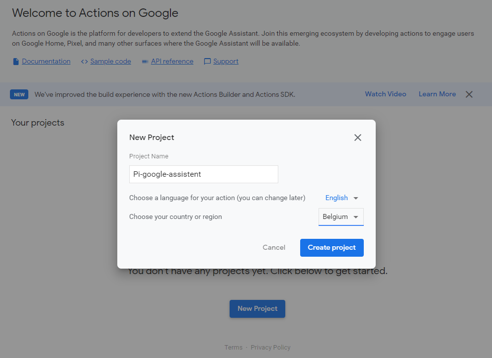
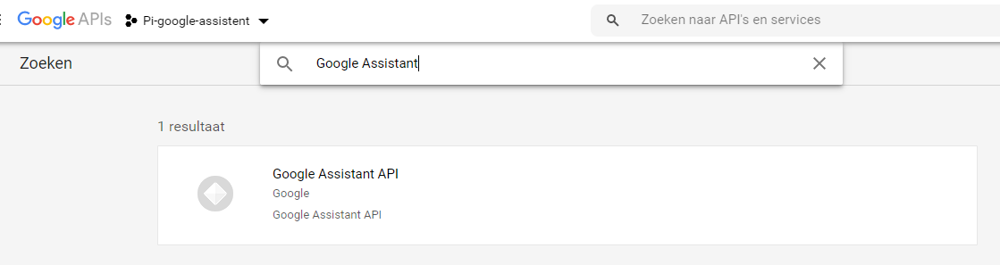
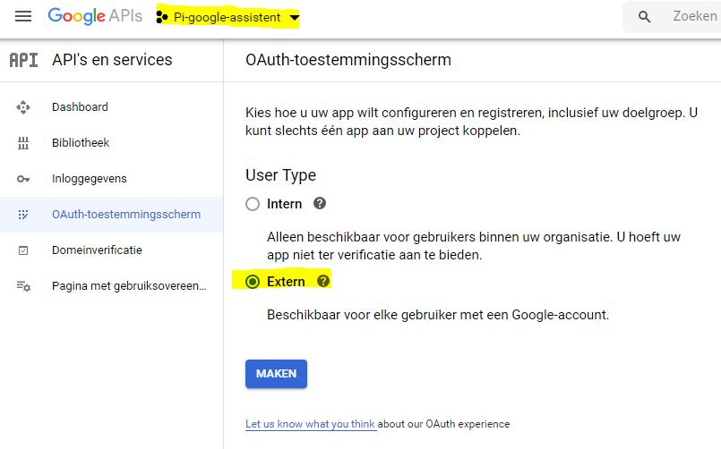
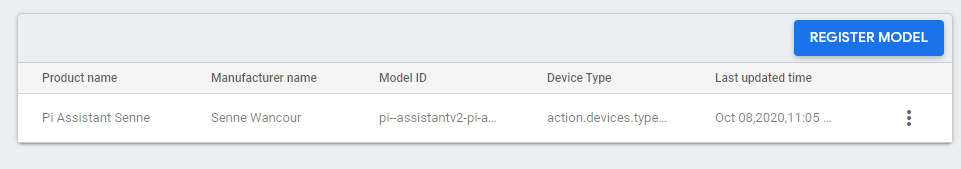

# Stappenplan voor Google

## Stap 1: Nieuw project aanmaken
Om te beginnen aan het Pi Google Assistant maken we een nieuw google actions project aan.
Surf naar volgende [link](https://console.actions.google.com/) en klik op 'new project'.

Vul de gegevens in die nodig zijn voor de projectregistratie.

Klik daarna door op de link onderaan met 'device registration'. Dit is belangrijk, anders kan je geen devices toevoegen.
We komen in stap 4 terug op de apparaat registratie.

## Stap 2: Activeren van google Assistant api
De volgende stap omvat het activeren van de google Assistant API.
Surf naar volgende [link](https://console.developers.google.com/apis)  en klik op 'ENABLE API AND SERVICES' op het dashboard van APIs & Services.

Zoek naar 'Google Assistant API' en installeer de API.

Ga vervolgens terug naar het hoofdmenu en selecteer bovenaan het juiste project.
Daarna klik je in de sidebar op 'OAuth-toestemmingsscherm' waar je 'Extern' aanvinkt.
Ten slotte klik je op 'maken'.

Op deze pagina controleer je uw ondersteunings-emailadres en sla je de instellingen op.

## Stap 3: Google activiteiten
In de volgende stap ga je naar deze [link](https://myactivity.google.com/activitycontrols). Dit leid je naar de pagina van google activiteiten.
Eens de pagina geladen is, vink je volgende activiteitencontroles aan.

- Web- en app-activiteit
- Chrome geschiedenis
- Locatie geschiedenis
- Stem en audio opnames

## Stap 4: Apparaat registratie
Ga terug naar het Google Actions platform en klik in het tabblad development op 'Device registration'.
Druk vervolgens op de knop 'Register model'.

Vul de lege velden in en gebruik als device type: speaker.
Kopieer het model id alvorens je verder gaat, plak dit ergens in kladblok of schrijf het op. 
Het model id heb je later nog nodig.

Druk nu op 'Register model'.

In de volgende stap download je de credentials en sla je ze op op een gekende plaats op je pc.
Skip de traits stap en als alles goed ging, staat je apparaat nu geregistreerd.

